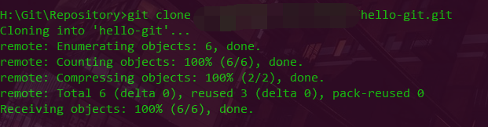
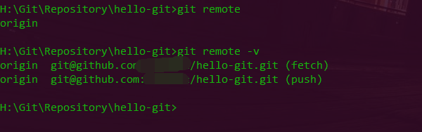

## Git Collaboration 协作与远程

使用`git`，怎么允许自己在本地自娱自乐，`git`通过远程拉取代码、提交代码才能发挥`git`重要作用


#### 远程克隆

* 在`github`上添加一个仓库，并把它克隆到本地
* 注意，遇到`permission`问题，请查看`99.ssh-key-permission`

```bash
$ git clone git@github.com:username/repositoryname.git
```




#### git remote 命令（查看库信息、地址、关联等）

```bash
$ git remote                     查看远程仓库
$ git remote -v                  查看远程仓库地址

$ git remote add repositoryName repositoryUrl                    关联一个远程库，一般将repositoryName 取为 origin
$ git remote rm repositoryName                                   删除关联

$ git remote set-url --push newRepositoryName newRepositoryUrl   远程修改
```



#### git fetch 远程拉取仓库信息

* 这条命令拉取了远程仓库的信息，从而得到了远程分支、提交等信自

```bash
$ git fetch origin
```

