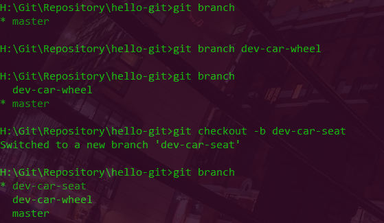
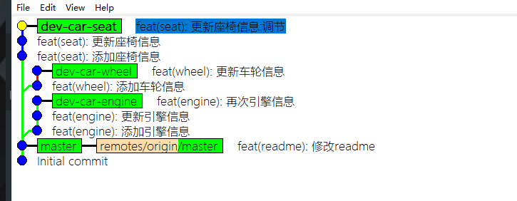
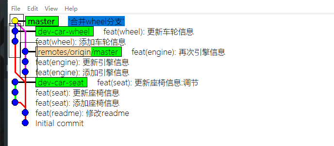
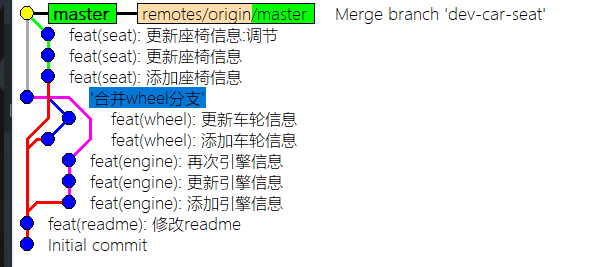

## Git Branch

* 所有的版本控制系统都有分支概念，`Git`尤甚，`Git`倡导在分支上做开发任务，而非`master`以避免对`master`产生影响
* `Git`分支相当轻量，以至于一个项目常有多个分支并行开发，一个功能点也可以作为一个分支存在
* 实际上，分支仅包含所指对象校验和（长度为40的SHA-1值字符串）的文件，故创建和销毁都非常高效（不像其他版本控制系统，创建分支是复制粘贴）
* 分支，是`git`最有灵魂的东西

#### 创建与查看

```bash
$ git branch                    查看当前分支

$ git branch dev                创建 dev 分支 

$ git checkout dev              切换工作区到 dev 分支
$ git checkout -b dev           创建并切换工作区到 dev 分支 

```



#### 重命名
```bash
git branch -m oldBranch newBranch           重命名，如遇冲突使用 -M
```


#### 删除

```bash
$ git branch -d branchname      删除掉一个分支
$ git branch -D branchname      强制删除掉一个分支，用于当分支未合并或是
```


#### 合并

* 在`git`中，创建一个分支，在完成开发之后，通常会将它合并到`master`上，并删除该分支，完成开发

```bash
$ git merge branchname                                 将一个分支合并到当前分支上
```

* 先来看看一个开发记录(三个分支分别开发了不同信息)



* 普通的分支合并采用的是 `Fast forward` 模式，此模式合并完，如果删除分支，分支信息将会丢失
* 使用 `--no-ff` 参数可以避免这种情况，以及添加合并的信息，保持分支的来源与合并目标

```bash
# 将一个分支合并到当前分支上，使用 `--on-ff` 避免使用 `Fast forward` 模式，保留了分支原来的提交记录
$ git merge --no-ff -m 'merge information' branchname  
```


#### 查看分支合并图

* 通常我们也不会使用命令行查看分支合并图，使用`gui`能更直观查看合并的信息
* 虽然看起来很乱，但由分支主导整个开发流程的`git`管理，就是这个样子的

```bash
git log --graph             
git log --graph --pretty-oneline --abbrev-commit            查看简略版本            
```



