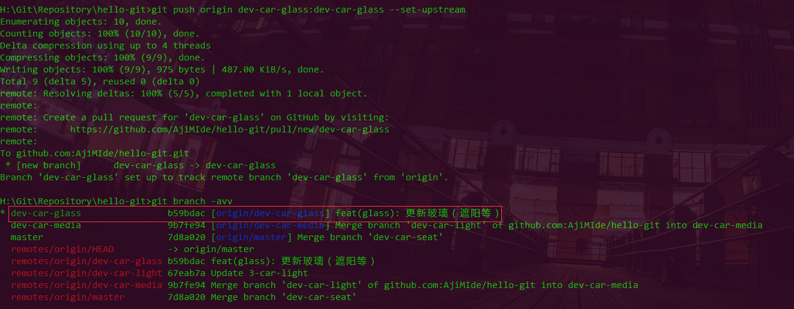

## 分支的远程操作

* 在本地的自娱自乐远远不能满足开发需求


#### 远程查看分支

* 如果没有看到该有的分支，请用：`git fetch origin`更新信息

```bash
$ git branch -r                 查看远程分支
$ git branch -a                 查看所有分支（远程的，本地的）

$ git branch -vv                查看本地分支与远程分支的映射关系
$ git branch -avv               查看所有分支（包括映射关系）
```


#### 远程拉取分支

* 当不指定远程名称和远程分支名，则默认当前分支(master)

```bash
$ git checkout -b localbranchname origin/originBranch       将远程分支拉到本地分支（新建）并切换工作区为此本地分支

$ git pull orignname branchname         拉取某个远程的某条分支(不创建本地 branch，而是将拉取的分支合并到当前本地的分支上)

$ git fetch origin orginbranchname:localbranchname      将远程分支拉到本地分支（新建），但不切换工作区
```


#### 远程删除分支

```bash
$ git push origin :originBranch     删除远程分支 
$ git branch -d -r originBranch     同上
$ git push origin -d originBranch   同上
```


#### 远程推送(远程推送分支)

```bash
# 远程没有此分支的时候
$ git push origin localBranch:originBranch     推送分支到远程

# 远程没有此分支的时候
$ git push origin localBranch:originBranch --set-upstream   推送分支到远程并创建联系

# 远程有此分支但是未关联本地分支时
$ git push -u origin/originBranch     推送到远程的某个分支下

# 远程已有此分支且已经关联
$ git push
```



#### 远程分支与本地分支做映射

```bash
$ git branch -u origin/branchname                                  将当前分支与远程分支映射
$ git branch --set-upstream-to origin/branchname                   同上
$ git branch --set-upstream-to yourBranchName origin/branchname    同上
$ git branch --track yourBranchName origin/branchname    同上

$ git branch --unset-upstream                       将当前分支与远程分支用户脱离关系
```
