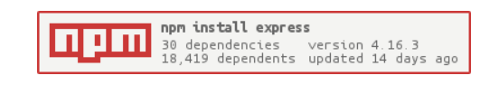
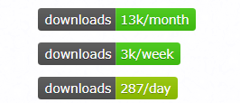

## 发布自己的 npm 包

#### 参考：
* [npm publish npm packages](https://docs.npmjs.com/getting-started/publishing-npm-packages)

#### 注意事项
* 发布的包的目录下须有 package.json, readme.md 文件，并记录相关信息
* 主入口需要有一个 index.js，参考其他包构建
* 使用`.gitignore` 或 `.npmignore`来屏蔽不想发布的文件
* 如果使用了淘宝镜像，注意需要切回来
* **包名**，必须是他人没用过的，要求简洁、易记、不引入混淆、困扰、不用他人商标等
* readme.md 不会被更新，除非当你 version 一个新版本，并且 publish
```bash
npm config set registry http://registry.npmjs.org
```

#### 准备工作
* 阅读一下 npm 条例与政策 [npmjs.policies](https://www.npmjs.com/policies)
* 创建一个 npm 账号
* 检查你的账号是否存在：
```bash
https://www.npmjs.com/~<username>
```

#### 开始
```bash
> npm login             # 会提示输入 username/password/email等，登录完之后会有提示
> npm logout            # 登出
> npm whoami            # 查看当前身份
# 
> npm publish <package-name>                # 发布包
> npm unpublish <package-name> --force      # 退回包
> # 可以 cd 到包目录进行发布
# 
> npm version <update_type>                 # 更新的命令，update_type 查看官网
> npm version 1.1.1                         # 更新为版本 1.1.1
> npm publish
```

#### 特别的
* 如果需要在项目首页，添加诸如像：下载次数、发行次数等信息，可以参考以下：
* [http://shields.io/](http://shields.io/)
* [https://nodei.co/](https://nodei.co/)
* 效果如下：



#### 圾


